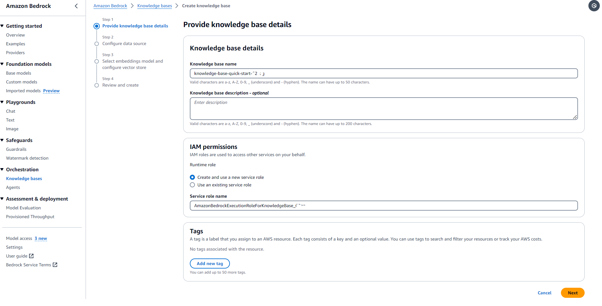
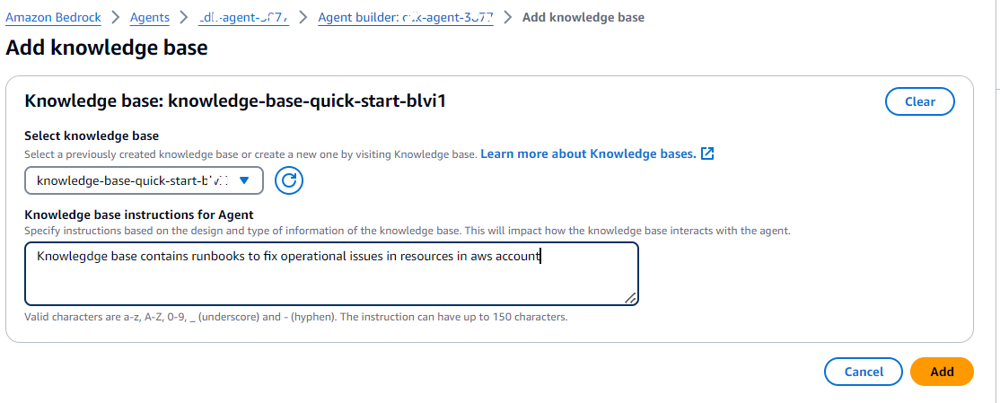
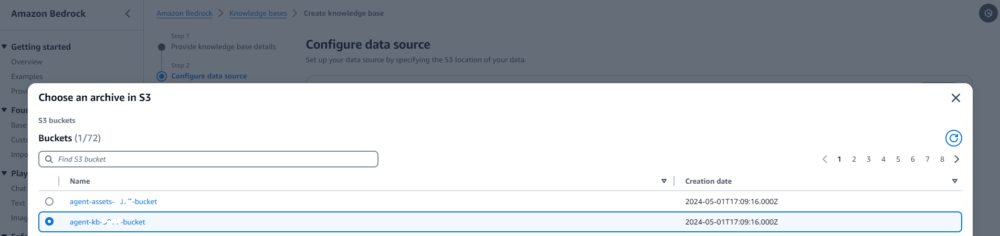
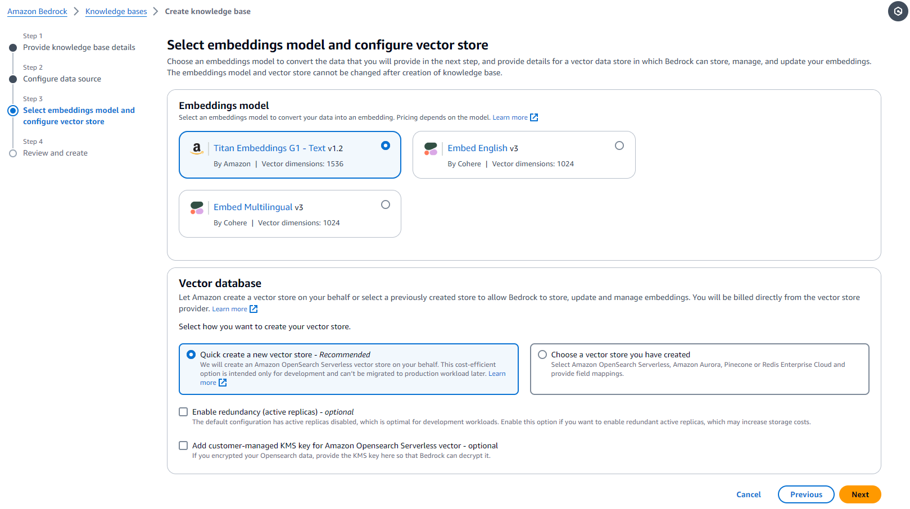
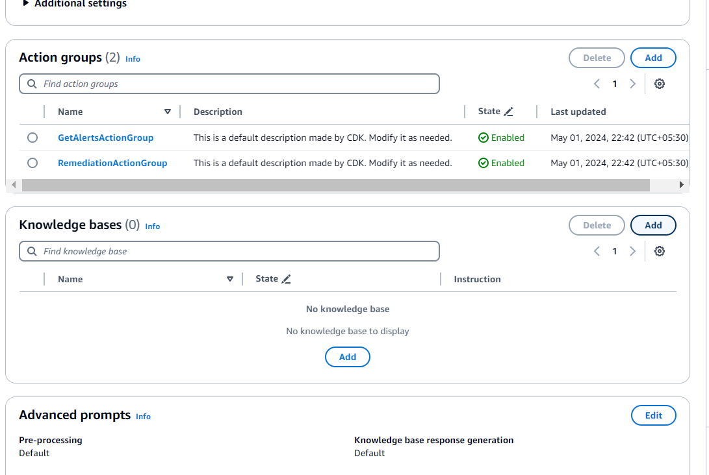
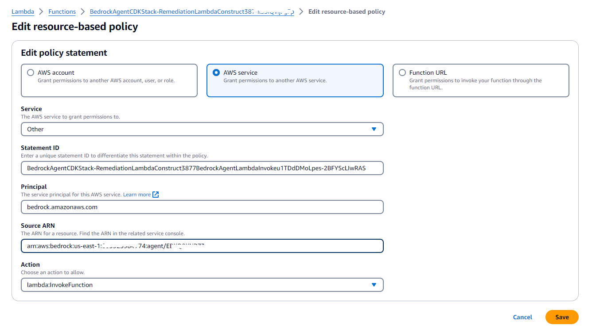
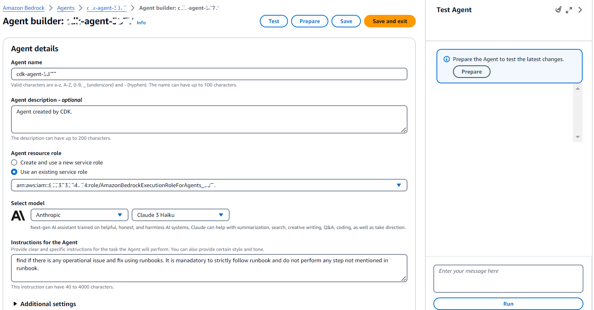
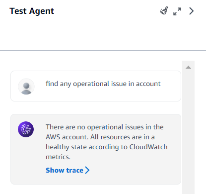

# Improving IT Operations Efficiency With AIOps

## Introduction
===============

In today's fast-paced digital landscape, IT operations teams are under constant pressure to ensure the smooth functioning of critical systems and infrastructure. However, manual intervention in incident management processes can be time-consuming, error-prone, and inefficient, particularly when dealing with a high volume of incidents. This is where Artificial Intelligence for IT Operations (AIOps) comes into play, offering a transformative solution to streamline incident management and enhance operational efficiency.

AIOps leverages the power of AI and machine learning to automate various aspects of IT operations, enabling faster incident detection, diagnosis, and remediation. By harnessing the capabilities of AWS services, organizations can build a robust AIOps pipeline that not only optimizes incident management but also provides real-time visibility, predictive analytics, and automated remediation capabilities.


## Solution Overview:

This Sample presents a comprehensive solution that combines various AWS services to create an AIOps pipeline tailored for effective incident management. At the core of this solution is the Amazon Bedrock service, which enables the deployment of intelligent agents capable of monitoring IT systems, analyzing logs and metrics, and triggering automated remediation processes.

## Getting started

This guide details how to install, configure, and use an example agent for AIOps using CDK deployment. The instructions assume that the deployment will be deployed from a terminal running from Linux or MacOS.

## Resources provisioned by deployment:

* Amazon S3 bucket
* Amazon Bedrock Agent
* Action Group
* Amazon Bedrock Agent IAM role
* Amazon Bedrock Agent Action Group
* AWS Lambda function
* AWS Lambda service-policy permission 
* AWS Lambda IAM role

The tutorial deploys Amazon Bedrock agent backed by Anthropic Claude3 Haiku model and creates an Action Group within this agent with the schema that user uploads to ``lib/assets/api-schema`` and Python function that user uploads to ``lib/assets/lambdas/agent``. To do that, the demo also creates an Amazon S3 bucket and uploads schema to it. By default IAM roles that are provisioned by CDK are empty so make sure you attach policies appropriate for your needs.

## Prerequisites
=============

* node >= 16.0.0
* npm >= 8.0.0
* AWS CLI >= 2.0.0
* AWS CDK >= 2.66.1

## How to run

Before you start, make sure you upload the python function to ``lib/assets/lambdas/agent`` and api schema to ``lib/assets/api-schema`` that you want your action group within your agent to have. By default it has template lambda ``create-agent.py`` and API schema ``create-agent-schema.json`` that will be used in deployment. Make sure you remove these files if you upload your own schema and Python file for AWS Lambda. Your AWS Lambda hanlder function must be `lambda_handler()`.

From within the root project folder (``bedrock-agent-cdk``), run the following commands:

```
npm install
```
Note - if you have `npm ERR!` erros related to overlapping dependencies, run `npm install --force`.
```
cdk bootstrap
```

```
cdk deploy BedrockAgentCDKStack --require-approval never --parameters BedrockAgentCDKStack:EmailAddressParam=operations@example.com
```
Note: Replace operations@example.com with email address of operations team 

Optional - if you want your agent to have a custom name you can do deployment like this (substituting "my-agent-name" with your desired name):

```
cdk deploy BedrockAgentCDKStack -c agentName="AI-Ops-agent-name" --require-approval never --parameters BedrockAgentCDKStack:EmailAddressParam=operations@example.com

```

# Creating a Knowledge Base in Amazon Bedrock

## Step 1: Provide Knowledge Base Details

In the first step, we create a new knowledge base by providing the following details:

- Knowledge Base Name: `knowledge-base-quick-start-xxxx`
- Description: (Optional) A brief description of the knowledge base.
- IAM Permissions: We choose to create and use a new service role named `AmazonBedrockExecutionRoleForKnowledgeBase_xxxx`.
- Tags: (Optional) We can add tags to the resource for better organization and cost tracking.



## Step 2: Configure Data Source

We select an Amazon S3 bucket named `agent-kb-xxxx-bucket` as the data source for the knowledge base. This bucket contains all the runbooks that will be used by the knowledge base.



## Step 3: Select Embeddings Model and Configure Vector Store

In this step, we choose the embeddings model and configure the vector store:

- Embeddings Model: We select the `Titan Embeddings G1 - Text v1.2` model provided by Amazon with vector dimensions of 1536.
- Vector Database: We choose to quickly create a new vector store (recommended for development workloads).
- Enable Redundancy: (Optional) We leave this option unchecked, which disables active replicas (optimal for development workloads).
- Customer-managed KMS Key: (Optional) We leave this option unchecked, as we are not encrypting the OpenSearch data.


## Step 4: Add Knowledge Base to Existing Agent

After creating the knowledge base, we add it to an existing agent named `AIOps-agent-xxxx` by following these steps:

1. In the agent builder, navigate to the "Additional settings" section.
2. Under "Knowledge bases," click the "Add" button.
3. Select the `knowledge-base-quick-start-xxxx` knowledge base.
4. Provide the instruction: "Knowledgde base contains runbooks to fix operational issues in resources in aws account."

```
Knowlegdge base contains runbooks to fix operational issues in resources in aws account

```


## Step 5: Set Agent's ARN in AWS Lambda Functions Resource Policy

To allow the Amazon Bedrock agent to invoke the necessary AWS Lambda functions, we edit the resource-based policy of the AWS Lambda function (`BedrockAgentCDKStack-RemediationLambdaConstructxxxx-xxxx`) and add a statement with the following details:
```
{
  "ArnLike": {
    "AWS:SourceArn": "arn:aws:bedrock:us-east-1:xxxxxxx:agent/xxxxxxx"
  }
}
```

- Service: `bedrock.amazonaws.com`
- Source ARN: `arn:aws:bedrock:us-east-1:xxxx:agent/xxxxxxxx` (Replace with your agent's ARN)
- Action: `lambda:InvokeFunction`


## Step 6: Prepare and Test the Agent



Finally, we prepare the agent by clicking the "Prepare" button in the agent builder. After the preparation is complete, we can test the agent by entering a query like "find any operational issue in account" in the testing interface.

```
find any operational issue in account and fix issue as per knowledgebase
```



The agent will use the knowledge base to search for and provide relevant information about any operational issues in the AWS account, following the instructions provided during the knowledge base setup.

# How to delete

From within the root project folder, run the following commands:

```
cdk destroy --force --all
```

